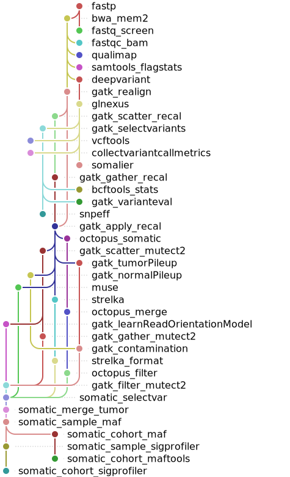
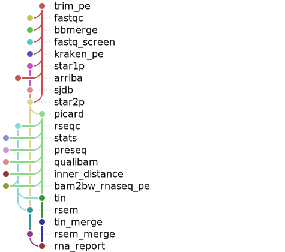
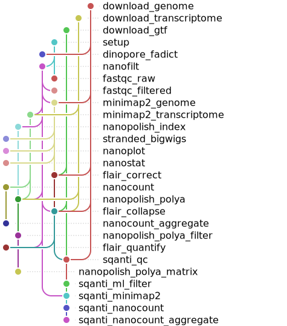
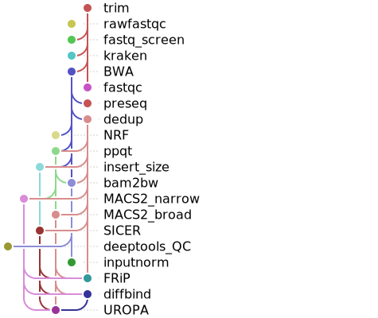
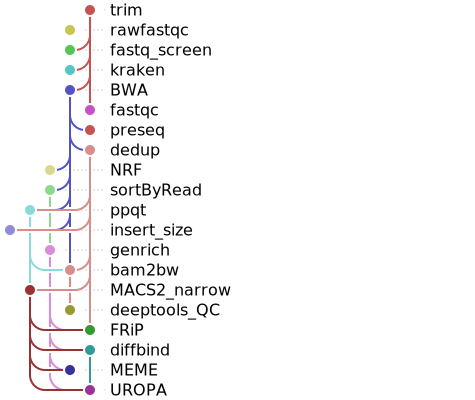

<div align="center">
   
  <h1>snakevision 🐍</h1>
  
  **_An awesome tool to visualize Snakemake DAGs_**

[](https://doi.org/10.5281/zenodo.18988674)
[](https://github.com/OpenOmics/snakevision/releases)<br>
[](https://github.com/OpenOmics/snakevision/actions/workflows/testing.yaml)
[](https://github.com/OpenOmics/snakevision/issues)
[](https://github.com/OpenOmics/snakevision/blob/main/LICENSE)

</div>

## Overview

Welcome to snakevision! Before getting started, we highly recommend reading through our documentation below.

**`./snakevision`** provides a simplified command-line interface to visualize Snakemake DAGs or rule graphs. If you are familiar with other existing tools to visualize DAGs like [graphviz](https://graphviz.org/), getting started with `snakevision` should be a breeze.

## Examples

Here are a few Snakemake rule graphs rendered by snakevision. These DAGs come from different pipelines available from [OpenOmics](https://github.com/OpenOmics).

<p float="left">
    
    
    <sup><b>Left:</b> A snakevision rule graph of a slimmed-down version of the whole genome sequencing pipeline, <a href="https://github.com/OpenOmics/genome-seek">genome-seek</a>.<br><b>Right:</b> A snakevision rule graph of a slimmed-down version of the <a href="https://github.com/OpenOmics/RNA-seek">rna-seek</a> pipeline.</sup>
</p><br>

<p float="left">
    
    
    <sup><b>Left:</b> A snakevision rule graph of a slimmed-down version of our Oxford Nanopore direct RNA-sequencing pipeline, <a href="https://github.com/OpenOmics/modr">modr</a>.<br><b>Right:</b> A snakevision rule graph of a slimmed-down version of our viral metagenomics pipeline, <a href="https://github.com/OpenOmics/metavirs">metavirs</a>.</sup>
</p><br>

<p float="left">
    
    
    <sup><b>Left:</b> A snakevision rule graph of a slimmed-down version of our ChIP-seq pipeline, <a href="https://github.com/OpenOmics/chrom-seek">chrom-seek run with the <code>--assay chip</code> option</a>.<br><b>Right:</b> A snakevision rule graph of a slimmed-down version of our bulk ATAC-seq pipeline, <a href="https://github.com/OpenOmics/chrom-seek">chrom-seek run with the <code>--assay atac</code> option</a>.</sup>
</p>

## Dependencies

**Requires:** `snakemake` `python>=3.7`

At the current moment, the tool is designed to visualize rule graphs of existing snakemake pipelines. As so, [Snakemake<sup>1</sup>](https://snakemake.readthedocs.io/en/stable/) and any dependencies of the pipeline should be installed on the target system. This tool relies on a few 3rd-party pypi python packages which can be installed via pip.

Please follow the instructions directly below to install snakevision on your local system.

## Installation

### PyPi

Snakevision is available on PyPi and can be installed using pip:

```bash
# Install directly from PyPi
# Create a python virtual environment
python3 -m venv .env
# Activate the virtual environment
source .env/bin/activate
# Install required snakevision and its
# required python packages
pip install -U pip
pip install snakevision
```

### Github

Snakevision is available on Github and can be installed using pip:

```bash
# Clone Repository from Github
git clone https://github.com/OpenOmics/snakevision.git
# Change your working directory
cd snakevision/
# Create a python virtual environment
python3 -m venv .env
# Activate the virtual environment
source .env/bin/activate
# Install required snakevision and its
# required python packages
pip install -U pip
pip install -e .
```

## Getting Started

Snakevision can read an input snakemake rulegraph via an input file or via standard input directly from a pipe. To create an input rule graph to the `snakevision`, please run snakemake with the `--rulegraph` and `--forceall` options.

### Basic example

Here’s a basic example showing how to generate a rule graph for a Snakemake workflow and visualize it with snakevision. For details on creating rule graphs, see the [Snakemake documentation](https://snakemake.readthedocs.io).

```bash
# Create a input file for snakevision
snakemake  --configfile=$pipeline_outdir/config.json \
    -s $pipeline_outdir/workflow/Snakefile \
    -d $pipeline_outdir \
    --forceall \
    --rulegraph \
> pipeline_rulegraph.dot

# Run snakevision, do not include
# rule all and multiqc in the image,
# makes final image less cluttered
snakevision \
    -s all mutliqc \
    -o pipeline_rulegraph.svg \
    pipeline_rulegraph.dot
```

### Customize DAG

Snakevision provides a few options to customize the style of the DAG output.
You can specify these options using the `-y` or `--styles` flag followed by the key-value pairs.
Use `-y` multiple times to specify multiple style attributes.
For example, you can change the size of the nodes and edges in the DAG by using the following command:

```bash
snakevision \
    -y node_radius=10.0 \
    -y edge_stroke_width=8.0 \
    -o pipeline_rulegraph.svg \
    pipeline_rulegraph.dot
```

### Run with example rulegraphs

In the `examples/` folder, there are a few example `.dot` input files that you can use to get started. These input files are generated from a slimmed-down version of the pipelines available from OpenOmics, and they are included in this repository for demonstration and testing purposes.

```bash
snakevision \
  -y node_radius=10 \
  -s all rnaseq_multiqc \
  -o rnaseq_rulegraph.svg \
  examples/rna-seek_rulegraph.dot
```

For the full list of available options, run `snakevision -h`.

## Contribute

This site is a living document, created for and by members like you. snakevision is maintained by the members of OpenOmics and is improved by continuous feedback! We encourage you to contribute new content and make improvements to existing content via pull requests to our [GitHub repository](https://github.com/OpenOmics/snakevision).

## Cite

If you use this software, please cite it as below:

<details>
  <summary><b><i>@BibText</i></b></summary>
 
```text
@software{kuhn_2026_18988675,
  author       = {Kuhn, Skyler and
                  Jahn, Michael},
  title        = {OpenOmics/snakevision: v1.0.0},
  month        = mar,
  year         = 2026,
  publisher    = {Zenodo},
  version      = {v1.0.0},
  doi          = {10.5281/zenodo.18988674},
  url          = {https://doi.org/10.5281/zenodo.18988674},
}
```

</details>

<details>
  <summary><b><i>@APA</i></b></summary>

```text
Kuhn, S., & Jahn, M. (2026). OpenOmics/snakevision: v1.0.0 (v1.0.0). Zenodo. https://doi.org/10.5281/zenodo.18988674
```

</details>

## References

<sup>**1.** Koster, J. and S. Rahmann (2018). "Snakemake-a scalable bioinformatics workflow engine." Bioinformatics 34(20): 3600.</sup>
