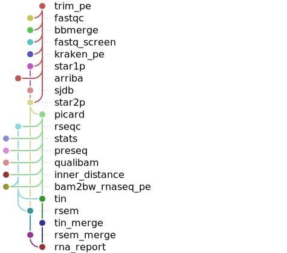
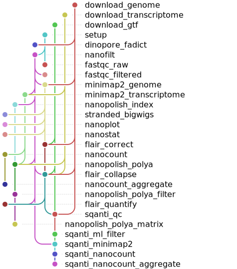
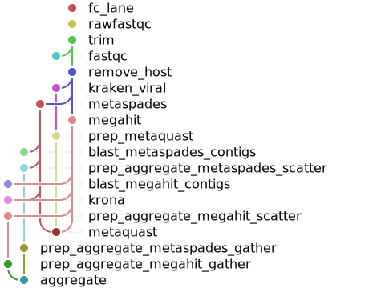

<div align="center">
   
  <h1>snakevision 🐍</h1>
  
  **_An awesome tool to visualize Snakemake DAGs_**

  [](https://github.com/OpenOmics/snakevision/issues)  [](https://github.com/OpenOmics/snakevision/blob/main/LICENSE) 
  
  <i>
    Its long-term goals: are to create awesome Snakemake workflow diagrams like no tool before!
  </i>
</div>

## Overview
Welcome to snakevision! Before getting started, we highly recommend reading through our documentation below.

The **`./snakevision`** provides a simplified command-line interface to visualize Snakemake DAGs or rule graphs. If you are familiar with other existing tools to visualize DAGs like [graphviz](https://graphviz.org/), getting started with `snakevision` should be a breeze. 

## Examples

Here are a few DAGs rendered by `snakevision`. These DAGs come from different pipelines available from [OpenOmics](https://github.com/OpenOmics).

<p float="left">
    
    
    <sup><b>Left:</b> A snakevision rule graph of a slimmed-down version of the whole genome sequencing pipeline, <a href="https://github.com/OpenOmics/genome-seek">genome-seek</a>. <b>Right:</b> A snakevision rule graph of a slimmed-down version of the <a href="https://github.com/OpenOmics/RNA-seek">rna-seek</a> pipeline.</sup>
</p><br>

<p float="left">
    
    
    <sup><b>Left:</b> A snakevision rule graph of a slimmed-down version of our Oxford Nanopore direct RNA-sequencing pipeline, <a href="https://github.com/OpenOmics/modr">modr</a>. <b>Right:</b> A snakevision rule graph of a slimmed-down version of our viral metagenomics pipeline, <a href="https://github.com/OpenOmics/metavirs">metavirs</a>.</sup>
</p>

## Dependencies
**Requires:** `snakemake` [`requirements.txt`](https://github.com/OpenOmics/snakevision/blob/main/requirements.txt)

At the current moment, the tool is designed to visualize rule graphs of existing snakemake pipelines. As so, [Snakemake<sup>1</sup>](https://snakemake.readthedocs.io/en/stable/) and any dependencies of the pipeline should be installed on the target system. This tool relies on a few 3rd-party pypi python packages which can be installed via pip from the provided [requirements.txt](https://github.com/OpenOmics/snakevision/blob/main/requirements.txt). 

Please follow the instructions directly below to install snakevision on your local system.

## Installation
Please clone this repository to your local filesystem using the following command:
```bash
# Clone Repository from Github
git clone https://github.com/OpenOmics/snakevision.git
# Change your working directory
cd snakevision/
# Create a python virtual environment
# to install required python packages
python -m venv .venv
# Activate the virtual environment
source .venv/bin/activate
# Upgrade pip and install the list
# of required python packages
pip install -U pip
pip install -r requirements.txt
# Get check installation, get 
# usage information of tool
./bin/snakevision -h
# Add snakevision to $PATH
export PATH="${PATH}:$PWD/bin"
```

## Getting Started

Snakevision can read an input snakemake rulegraph via an input file or via standard input directly from a pipe. To create an input rule graph to the `snakevision`, please run snakemake with the `--rulegraph` and `--forceall` options.

Here is an basic example:
```bash
# Create a input file for snakevision
snakemake  --configfile=$pipeline_outdir/config.json \
    -s $pipeline_outdir/workflow/Snakefile \
    -d $pipeline_outdir \
    --forceall \
    --rulegraph \
> pipeline_rulegraph.dot

# Run snakevision, do not include
# rule all and multiqc in the image, 
# makes final image less cluttered
snakevision \
    -s all mutliqc \
    -o pipeline_rulegraph.svg \
    pipeline_rulegraph.dot
```

## Contribute 
This site is a living document, created for and by members like you. snakevision is maintained by the members of OpenOmics and is improved by continuous feedback! We encourage you to contribute new content and make improvements to existing content via pull requests to our [GitHub repository](https://github.com/OpenOmics/snakevision).


## Cite

If you use this software, please cite it as below:  

<details>
  <summary><b><i>@BibText</i></b></summary>
 
```text
Citation coming soon!
```

</details>

<details>
  <summary><b><i>@APA</i></b></summary>

```text
Citation coming soon!
```

</details>

## References
<sup>**1.**  Koster, J. and S. Rahmann (2018). "Snakemake-a scalable bioinformatics workflow engine." Bioinformatics 34(20): 3600.</sup>  
